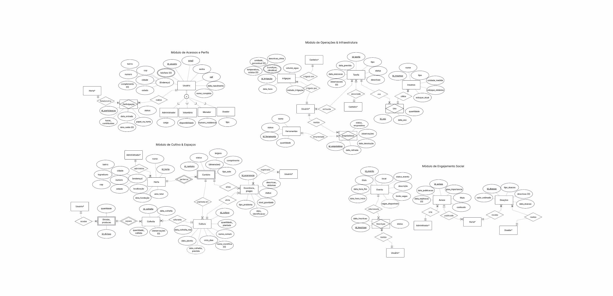

# 🌱 Banco de Dados - Horta Comunitária

Projeto final desenvolvido para a disciplina de Fundamentos de Banco de Dados (FBD). O sistema gerencia as operações de uma horta comunitária, incluindo o controle de insumos, a escala de voluntários e o registro da distribuição das colheitas.

## 🗂️ Etapas da Modelagem

O projeto foi construído respeitando a arquitetura de três esquemas:

### 1. Nível Conceitual
Mapeamento puro das regras de negócio sem dependência de tecnologia.
* **Artefato:** Diagrama Entidade-Relacionamento (DER).
* **

### 2. Nível Lógico
Tradução do modelo conceitual para o paradigma relacional, aplicando regras de normalização para evitar anomalias de inserção, atualização e exclusão. Definição de Chaves Primárias (PK) e Estrangeiras (FK).

### 3. Nível Físico
Implementação no Sistema Gerenciador de Banco de Dados (SGBD).
* Criação das estruturas de armazenamento (tabelas e arquivos).
* Definição de **índices** para otimização das consultas mais frequentes (ex: busca de voluntários por data).
* Scripts de criação (`DDL`) e manipulação (`DML`).

## 💻 Como testar os scripts

Os scripts SQL foram desenvolvidos para o SGBD [PostgreSQL].

1. Execute o script `scripts/01_ddl_criacao.sql` para gerar o esquema.
2. Execute `scripts/02_dml_insercao.sql` para popular as tabelas com dados de teste.
3. Utilize `scripts/03_dql_consultas.sql` para verificar as regras de negócio em funcionamento (ex: "Quantas mudas foram plantadas pelo voluntário X no mês Y?").

## 👩‍💻 Autora
Ana Beatriz (Bia) | Estudante de Engenharia de Computação
